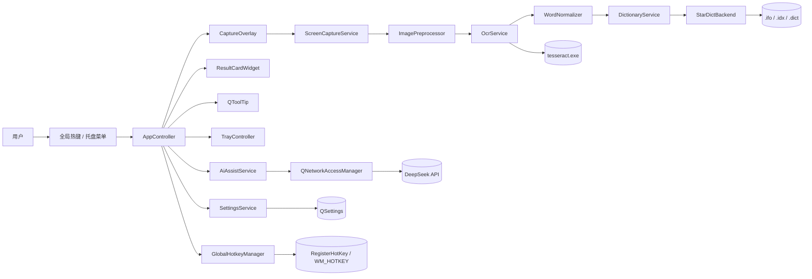
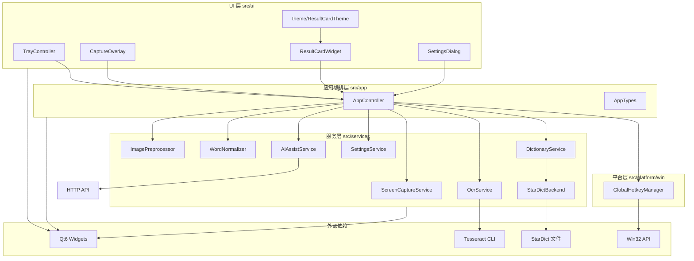
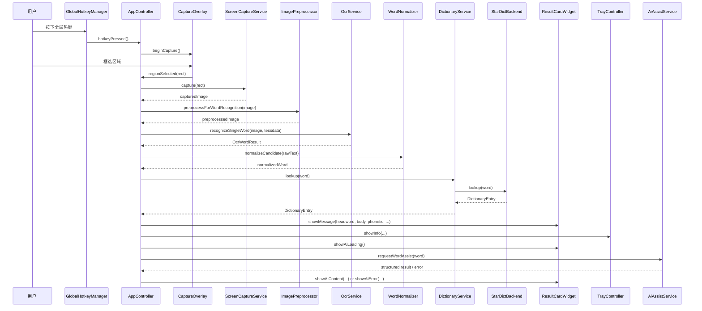
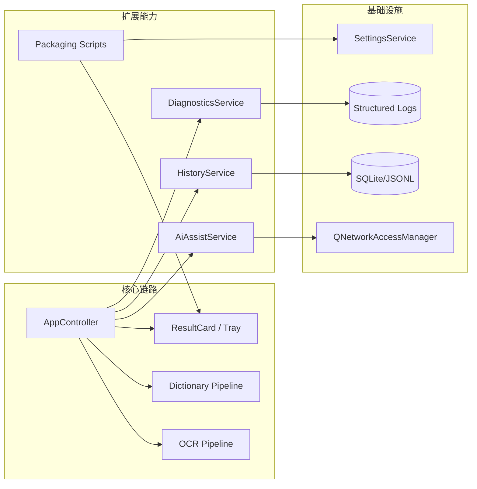

# wordSnapV1 架构说明

更新时间：2026-03-27

## 1. 架构目标

- 保持主链路清晰：截图 -> OCR -> 归一化 -> 查词 -> 展示。
- 让平台相关实现（Win32）与业务逻辑解耦，便于后续跨平台。
- 为 AI、历史、性能治理等新增能力预留可扩展边界。

## 2. 当前整体架构（运行视角）

## 3. 当前模块架构（代码组织视角）

## 4. 查词主流程时序图

## 5. 目标扩展架构（规划态）

## 6. 模块职责与边界

| 模块 | 职责 | 允许依赖 | 不应承担 |
|---|---|---|---|
| `AppController` | 业务流程编排、状态分派 | `ui/`, `services/`, `platform/win` | 复杂解析细节、平台 API 细节 |
| `ui/*` | 展示与用户交互 | `AppTypes`、Qt UI | 业务流程编排、数据持久化 |
| `services/OcrService` | OCR 调用与错误处理 | Qt Core、Tesseract CLI | 词典解析、UI 文案拼装 |
| `services/StarDictBackend` | 词典加载与查询 | Qt Core、文件系统 | UI 逻辑、热键逻辑 |
| `services/SettingsService` | 配置读写 | QSettings | 运行时业务决策 |
| `platform/win/*` | Win32 适配 | Win32 API | 业务展示与查词逻辑 |

## 7. 架构约束（当前）

- 维持 Windows-first：Win32 仅留在 `src/platform/win`。
- 不在核心链路引入异常机制，沿用返回值 + 错误消息模式。
- 新增能力（AI/历史/诊断）优先以 Service 方式接入，避免把复杂逻辑堆入 `AppController`。
- 任何跨层调用要先判断是否破坏边界；破坏边界的改动必须先做接口抽象。
